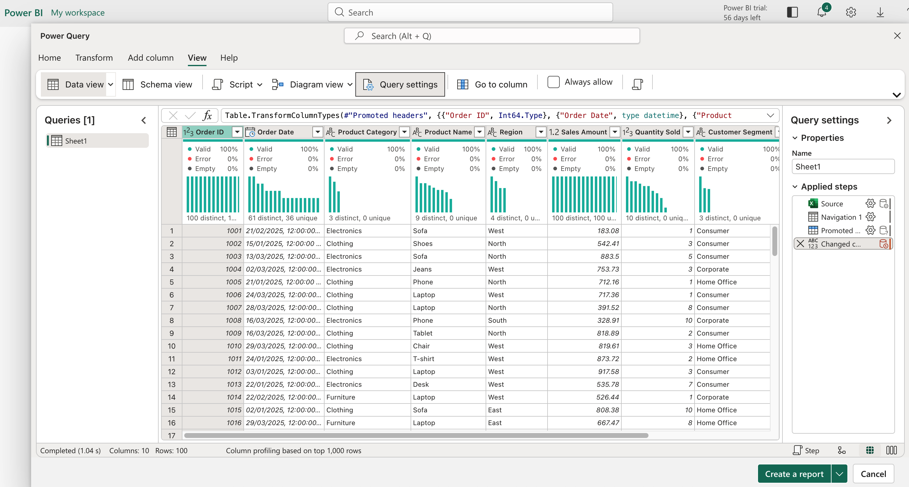
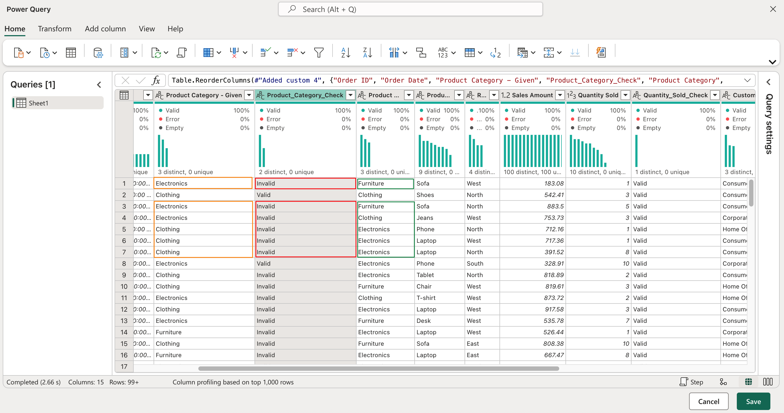
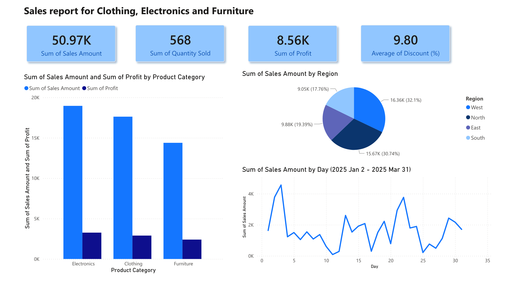

## Week5 - Activity2: Develop a simple dashboard
Load the dataset, clean the data (in LMS week5 -  Retail_Sales_sample-Dataset.xlsx), create four features/components, and publish the dashboard/report. Share your full insights and push all saved files to your GitHub repository.

## Activity notes
### Data load and check
The data is loaded into Microsoft Power BI web application. 

The data is about the sale figures information for 3 types of products — Clothing, Electronics, and Furniture — in four regions — East, North, West, South — for the period of Jan 2, 2025 to March 31, 2025.

As the preliminary checking, "Column Quality" are checked, the data is shown as clean in the screenshot below.
"Column Quantity" check takes care of checking data types in the same columns are uniform and logical. 

To check further, some columns are selected for detail checking.
When the Product name is "T-shirt", then Product Category should be Clothing, and so on.
Quantity Sold should be greater than 0.
Discount should be 0% to 100%.
Profit should be less the Sales Amount.
After this check, some erros are found for "Product Category" column.

So the original "Product Category" column is renamed as "Product Category - Given" and a column is added as "Product Category" with generated values accordingly (assuming that this activity is consulted with the SME).

As result, the data will look like as in the screenshot below.

### Dashboard
Using the updated data, a dashboard is created displaying four features.

1. A series of cards displaying 4 key information: Sum. of Sales Amount, Sum of Quantity Sold, Sum of Profit, and Average of Discount Percentage given.
2. An overview information in a Clustered Bar Chart for Sum of Sales and Sum of Profit for three product types.
3. A comparison information about the distribution of sales in four regions in a Pie Chart
4. A Line Chart showing some detail figures going up and down in the period

