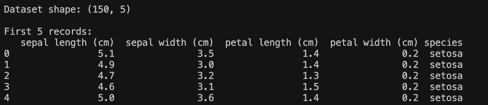
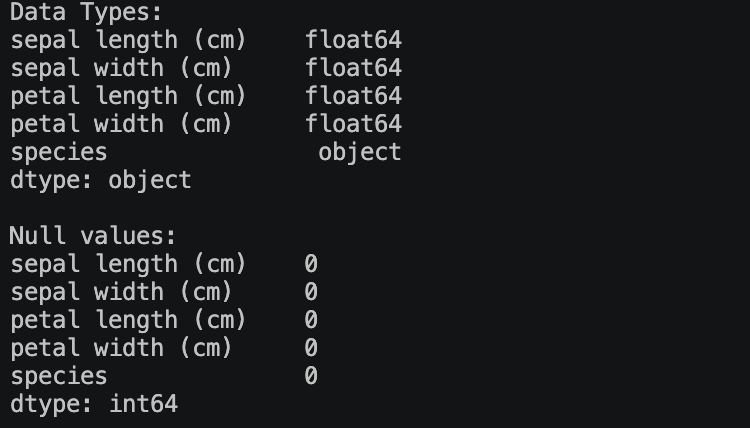
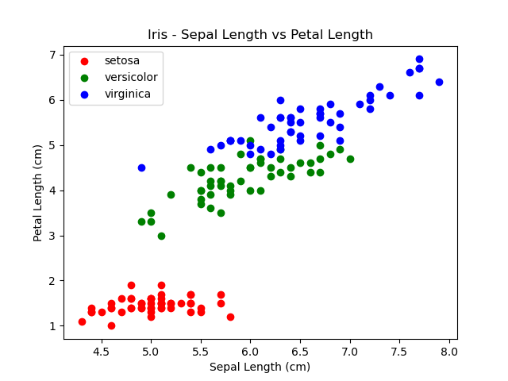
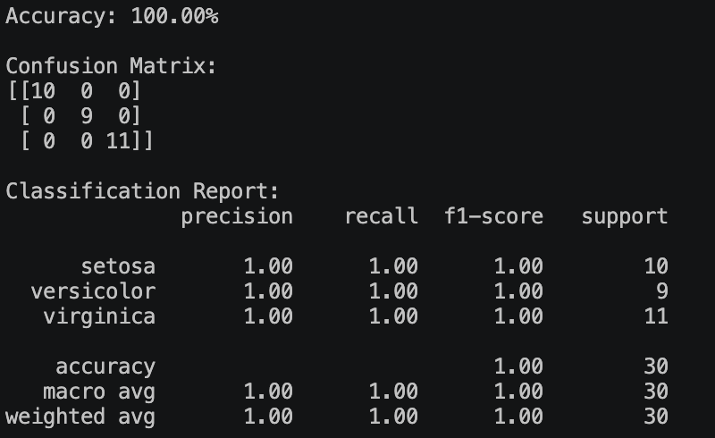

## Week6 Activity 1: SVM Classification - IRIS dataset
Load, clean, and visualise the Iris dataset, then train and test the SML model using a linear kernel. Share your evaluation metric results for the testing dataset. Also, add a README file with a short description and a screenshot of the results. Share your GitHub link when you have done.

## Activity Note

### Loading data
The data is loaded and printed first 5 records.

The data is explored and checked for any null or wrong data.

The data is trained and the result is depicted using Scatter plot.

The status of the training is printed.

### Understanding the status
Confusion matrix rows represent actual labels, and columns predicted, for 3 classes (setosa, versicolor, virginica).

**Precision**
Of all samples the model predicted as class X, how many actually were X?
When it says setosa, is it right?

**Recall**
Of all samples that actually are class X, how many did the model catch?
Did it find all the setosas?

**F1-score**
Hharmonic mean of precision and recall. Useful when you want a single balanced number.
F1 = 2 × (precision × recall) / (precision + recall)

**Support** 
Simply the count of actual samples per class in the test set (10, 9, 11 → total 30).

 