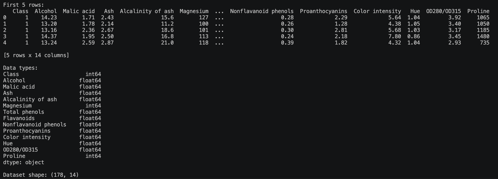
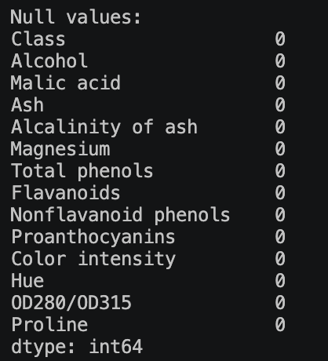
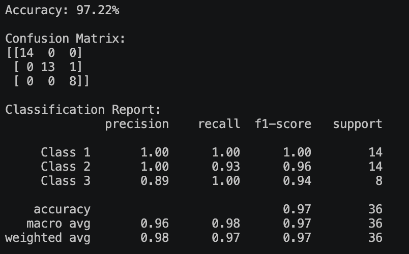
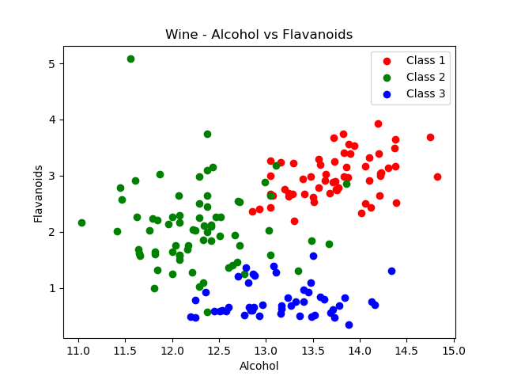
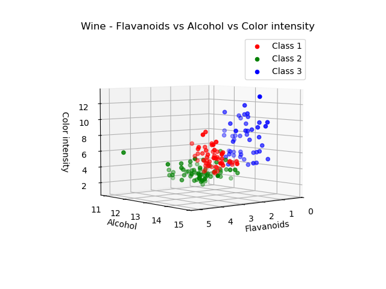
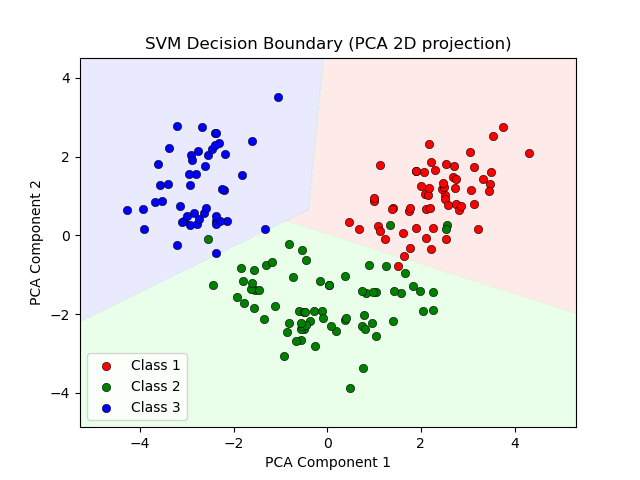

## Week 6 - Activity2: SVM Classification - wine dataset
Develop a script to train and test an SVM model, and share both the code and the results, including the evaluation metrics. Please refer to the provided dataset. link: https://archive.ics.uci.edu/dataset/109/wine

## Activity Note

The data is loaded and printed first 5 records.

The data is explored and checked for any null.

The model is trained and evaluated — accuracy, confusion matrix, and classification report are printed.

First, a 2D scatter plot on the features: Alcohol vs Flavanoids 

Second, a 3D scatter plot on the features: Flavanoids vs Alcohol vs Color intensity 

Finally, a scatter plot showing the SVM decision boundary, projected to 2D using PCA.

