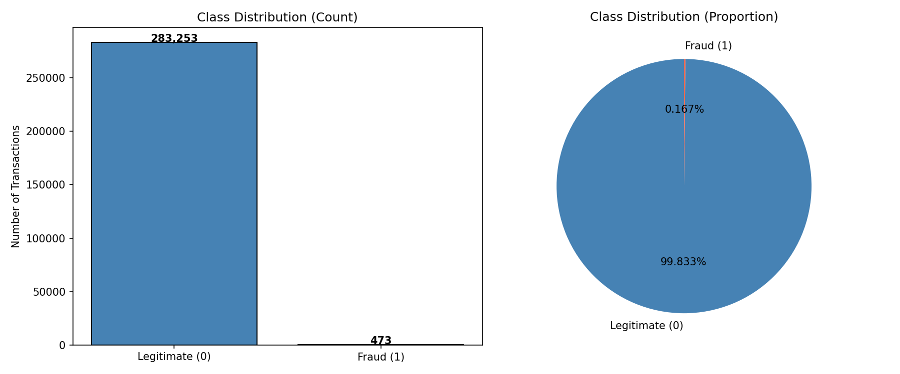
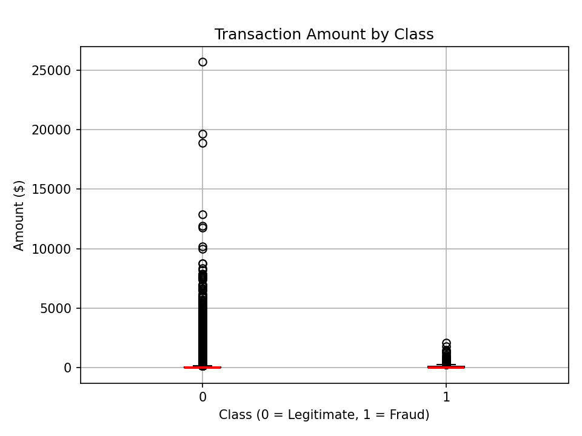
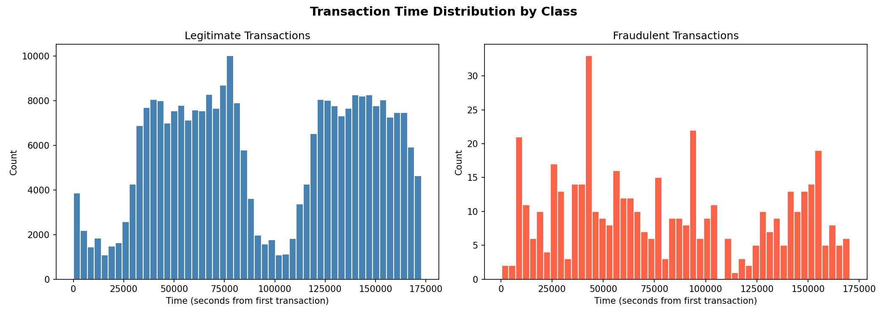
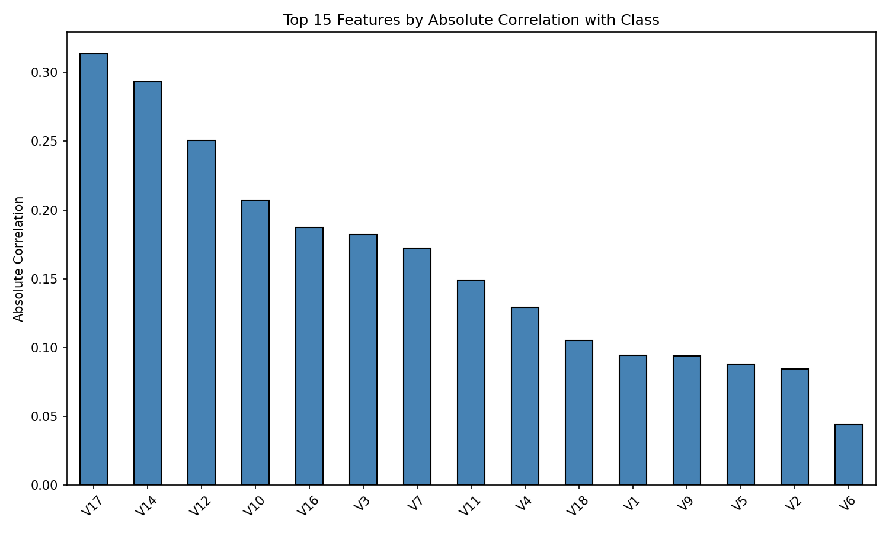
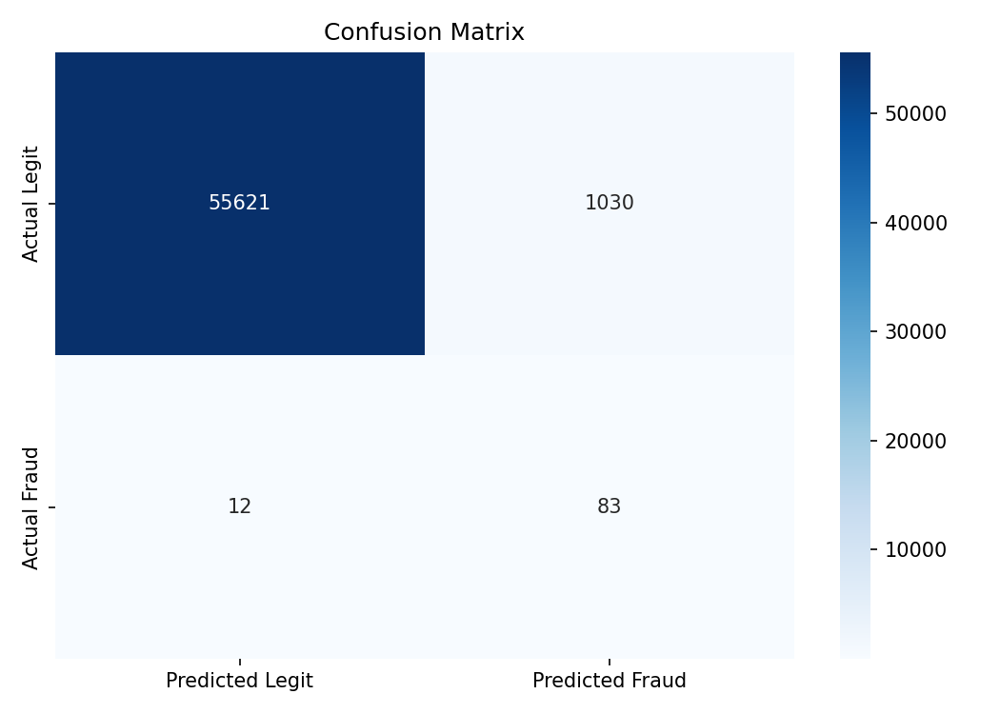
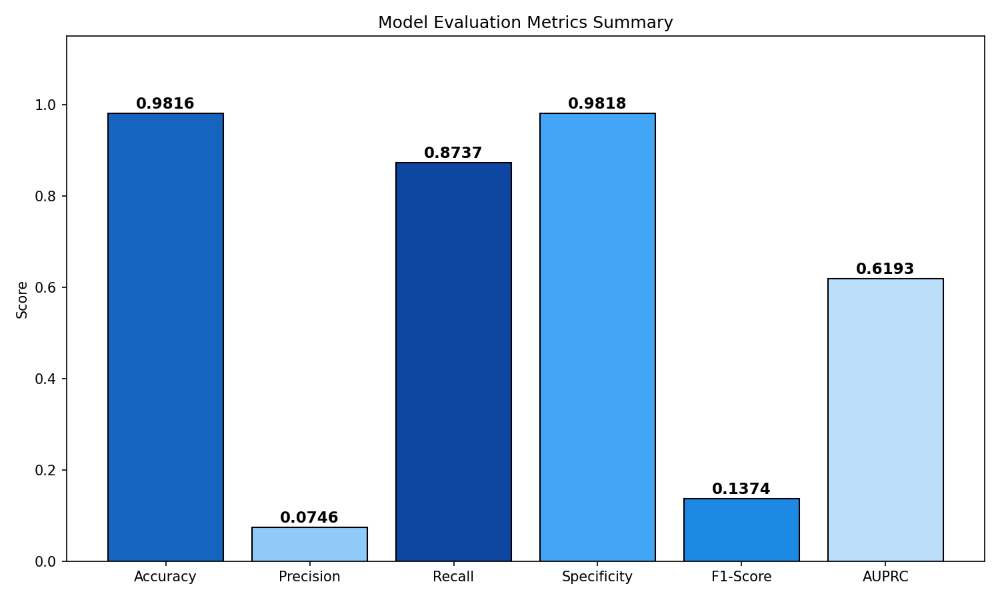
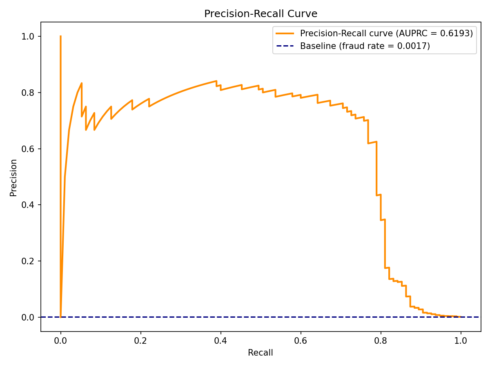

## Report 

### Title: Data Analysis on Credit Fraud
This report is about the data analysis on credit fraud based on the data shared publicly at https://www.kaggle.com/datasets/mlg-ulb/creditcardfraud.

### About Data 
There are 284807 records with 31 features. 
One of the features is Time which is the elapsed time from the first record - so the first record has the value 0.
Another feature is Amount which is transaction amount, and it is shared so that it _can be used for example-dependant cost-sensitive learning_ according to the data source. 
Another feature is Class, 0 means it is a legit transaction, and 1 fraud.
All the remaining features are transformed with PCA (Principal Component Analysis) for the confidentiality.

### Data Quality
No NULL values are found.
1081 duplicate records are found and cleaned up. 19 are Class 1.

### Exploratory Data Analysis
0.167% of the transactions are fraud. 99.833% are legit. Out of 283726 (which is 284807 - 1081), 473 are fraud.  

Most transactions are small amount, but there are many transactions with  significantly large amounts which are legit. 
Fraud transactions happen mostly on small amount. Fraud transactions happen up to about  3000 (amount).  

According to the chart depicting the Transaction Time Distribution by Class, fraud happens all throughout the timeline.

Top features which are correlated with Class are as shown below. This will be useful if the underlying data are better understood.

### Preparing the training model
Training / Testing Percentage: 80 / 20
SVM algorithm is chosen, using LinearSVC - class_weight value 'balanced' since the data is known as highly imbalanced, and iteration 2000.
SVC is not used because the dataset is too large. 

### Training outcome and evaluation
Training outcomes are as follows:

**Confusion Matrix**    

**Evaluation Metrics**

**Area Under the Precision-Recall Curve (AUPRC)**  
The graph shows that random guess will give only 0.17% correct while the model will give 61.93%-correct predictions, so it is a lot better with ML. However, for financial institutions, it is generally considered better to have 75% to 85%. If the resource is available (Higher memory, better CPU, and long processing time like hours), using SVC with kernel parameter 'rbf' might result better outcome.   

