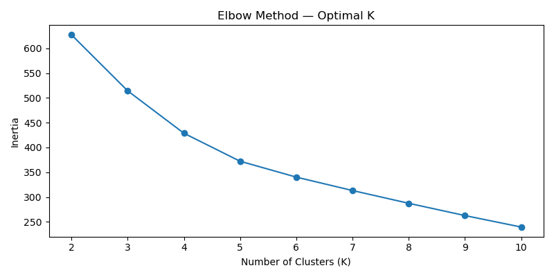
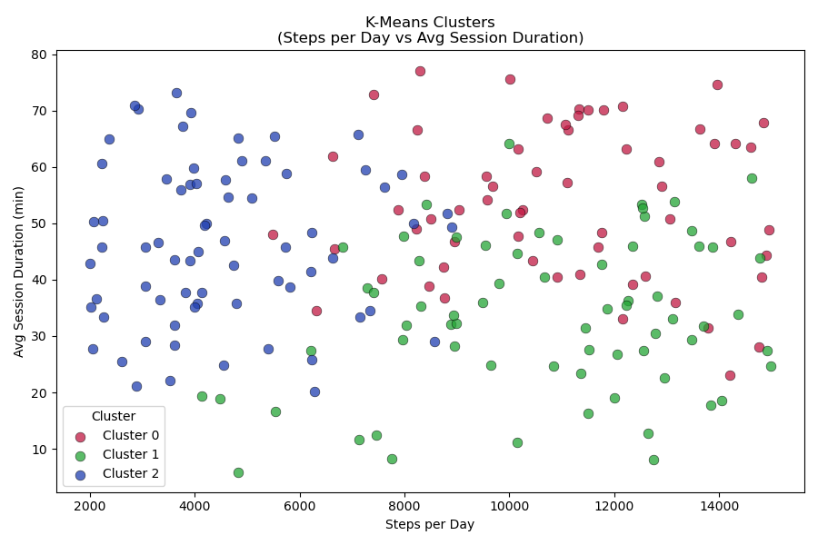

## Activity Note

### Data Cleaning
- Null check: OK
- Duplicate check: OK
- Data consistency check: Record with ID value 36 has negative value for Avg_Session_Duration_Min.  

### Clustering Analysis
- Chosen K value: 3 (Elbow method)

- Resulted clusters   
| Cluster | Age | Work per week | Average session duration | Steps per day |
| --- | --- |  --- | --- |  --- |
| 0 | 31.61  | 4.36 | 53.55 | 10985 |
| 1 | 48.53  | 2.43 | 33.59 | 10660 |
| 2 | 35.41  | 2.44 | 46.27 | 4544 |

Cluster 0 will be named as **AA: Active Adults**
Cluster 1 will be named as **AM: Active Mature**
Cluster 2 will be named as **EA: Easy Adults**

The distribution is as follows:
| Cluster | No. of people |
| --- | --- |
| Active Adults | 61 |
| Active Mature | 68 |
| Easy Adults | 70 |

