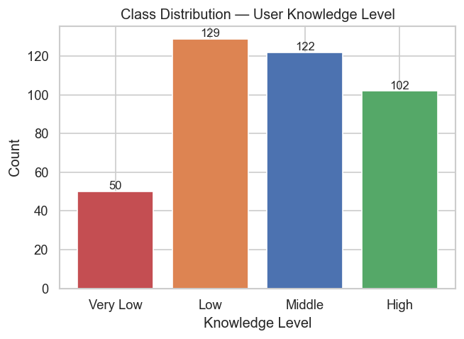
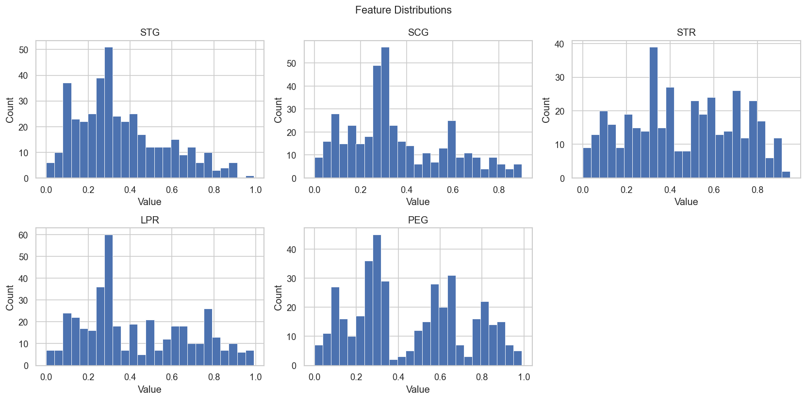
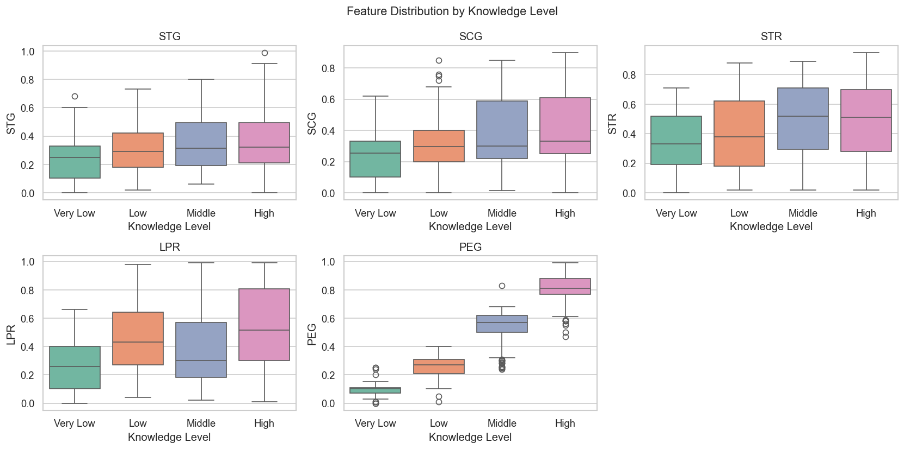
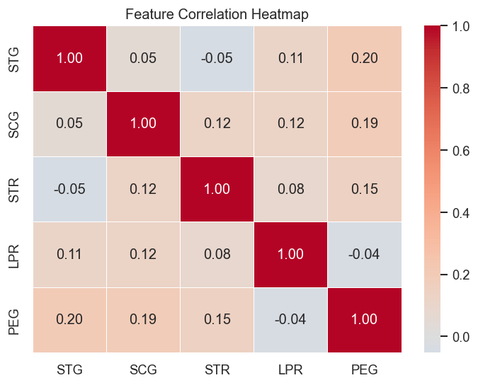
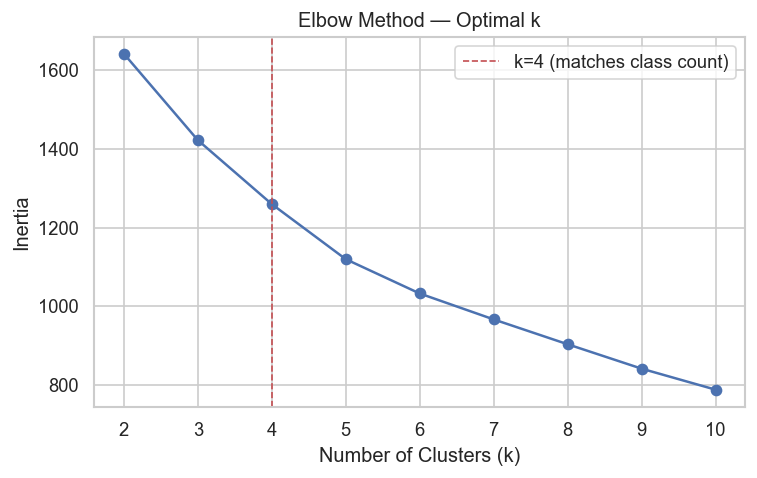
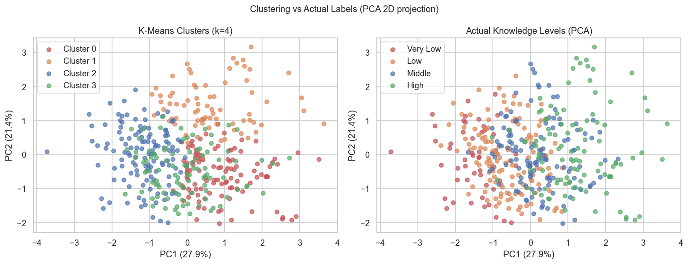
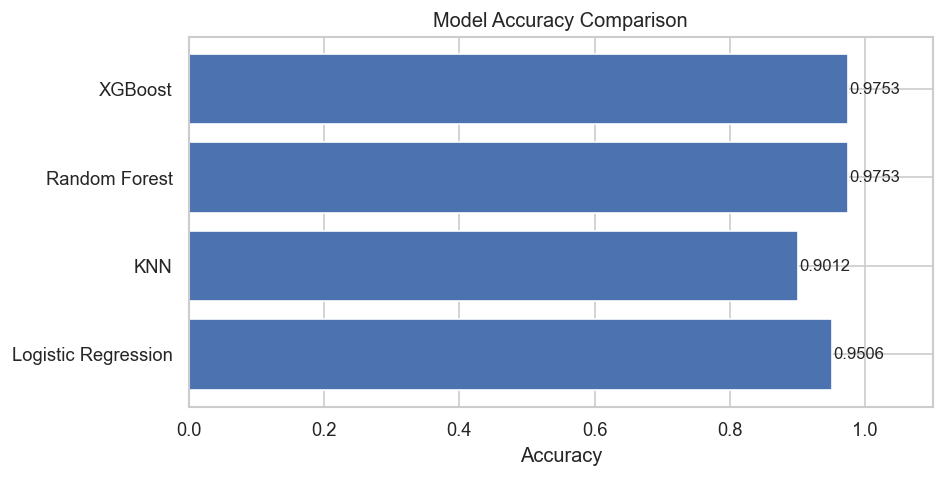
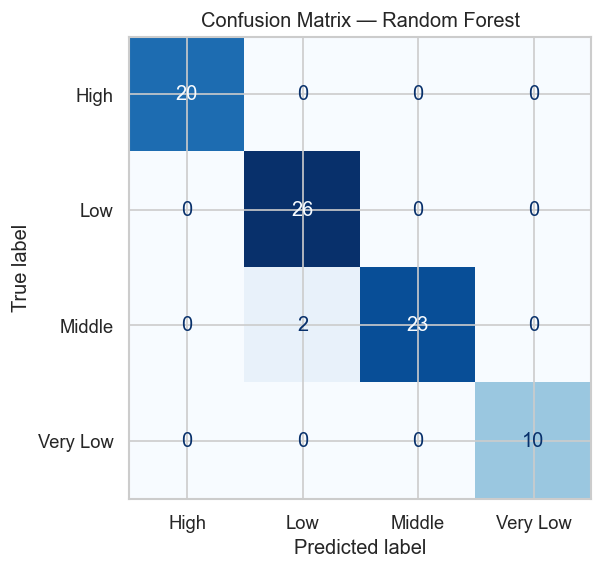
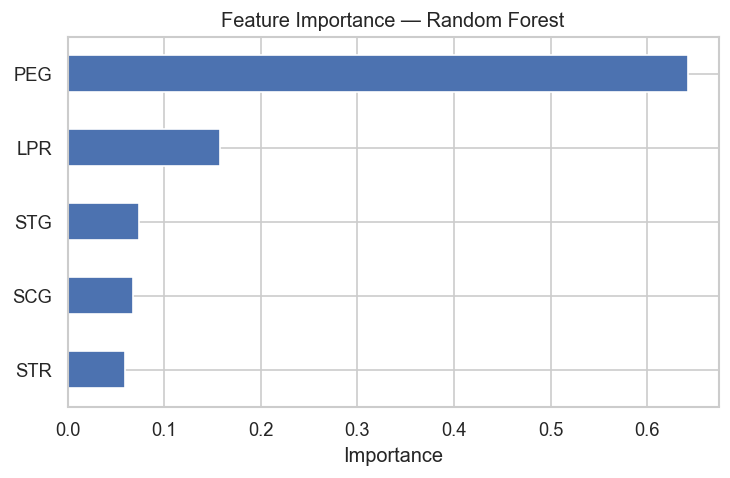

# User Knowledge Modeling — Analysis Report

## Dataset Overview

| Property | Value |
| --- | --- |
| Source | UCI ML Repository #257 |
| Rows | 403 |
| Features | 5 numerical |
| Target | UNS (User Knowledge Level) |
| Classes | Very Low, Low, Middle, High |

## Class Distribution

| Class | Count | % |
| --- | --- | --- |
| Low | 129 | 32.0% |
| Middle | 122 | 30.3% |
| High | 102 | 25.3% |
| Very Low | 50 | 12.4% |

## Preprocessing

- No null values found
- Duplicate rows checked and removed if present
- Features scaled using StandardScaler
- Target encoded using LabelEncoder

## Clustering — K-Means

- Elbow method used to identify optimal k
- k=4 selected (matches number of knowledge level classes)
- PCA used for 2D visualisation of clusters vs actual labels

## Classification Results

| Model | Accuracy |
| --- | --- |
| Logistic Regression | 0.9506 |
| KNN | 0.9012 |
| Random Forest | 0.9753 |  **Best**
| XGBoost | 0.9753 |

**Best model: Random Forest**

## Charts

