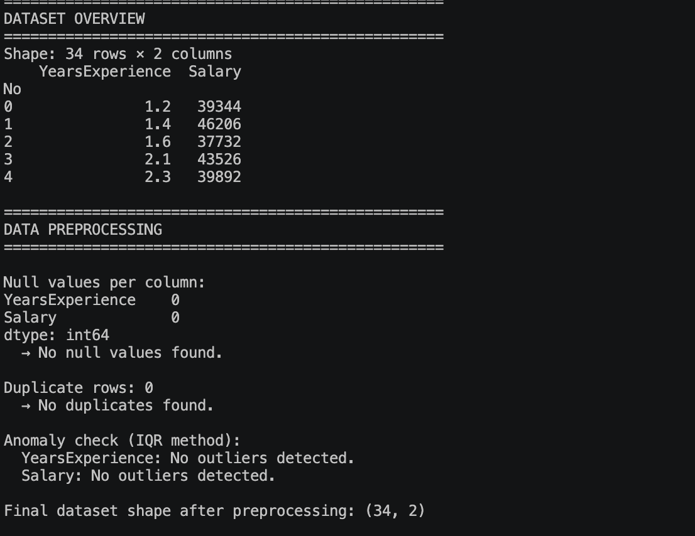
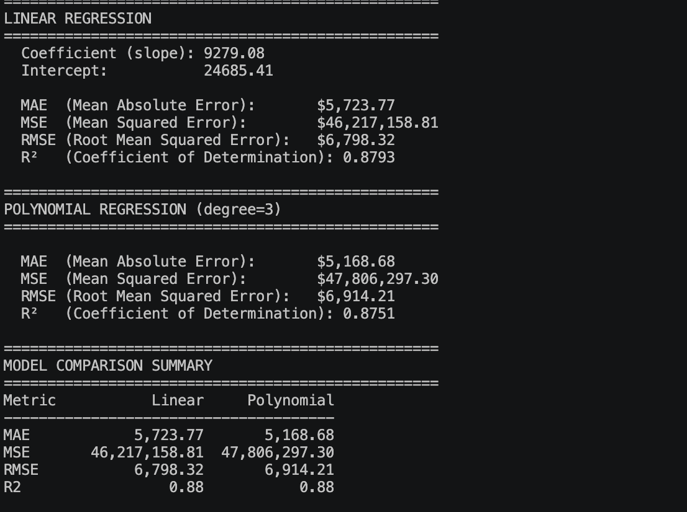
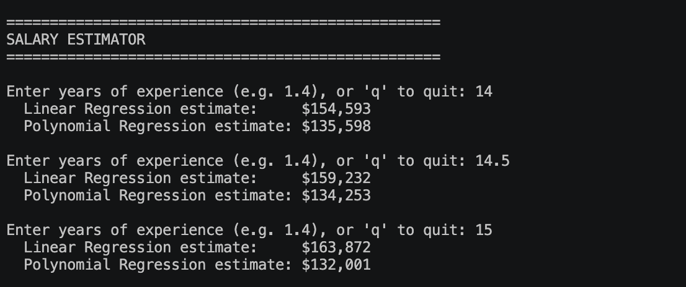

## Week 10 - Activity 1.1 - Predection time series dataset with regression
Use the sample dataset to implement both Linear Regression and Polynomial Regression models. Share your code and short description about the error metrics (e.g., MAE, MSE, and RMSE) for each model. Note: Use appropriate data cleaning and preprocessing steps before training and evaluating the models. File to use: salary-dataset (1).csv.

## Week 10 - Activity 1.2 - Predict salary using Regression model
To continue W10.A1.1 - Predict the salary for a person with 14, 14.5, and 15 years of experience using linear and polynomial regression. Share your GitHub Link here.
 
 ### Activity Note

 #### Data Loading and Preprocessing
 

 #### Error Metrics
 

 #### Estimations
 

 The learning note of the activity:
 [AcivityNote](StudyNote.md)

