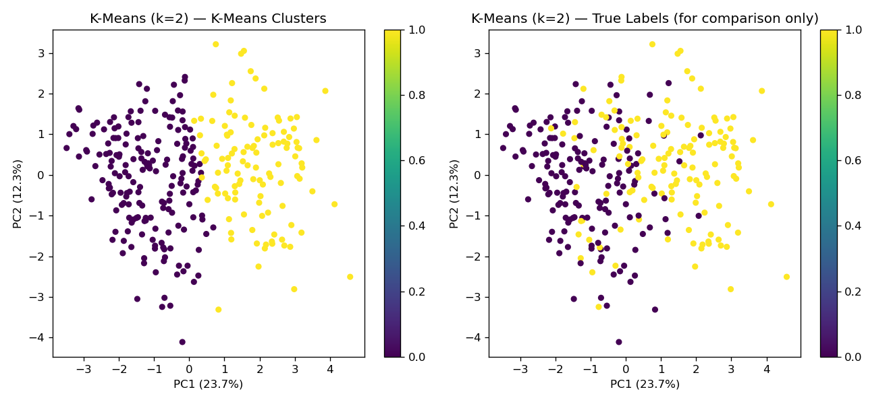
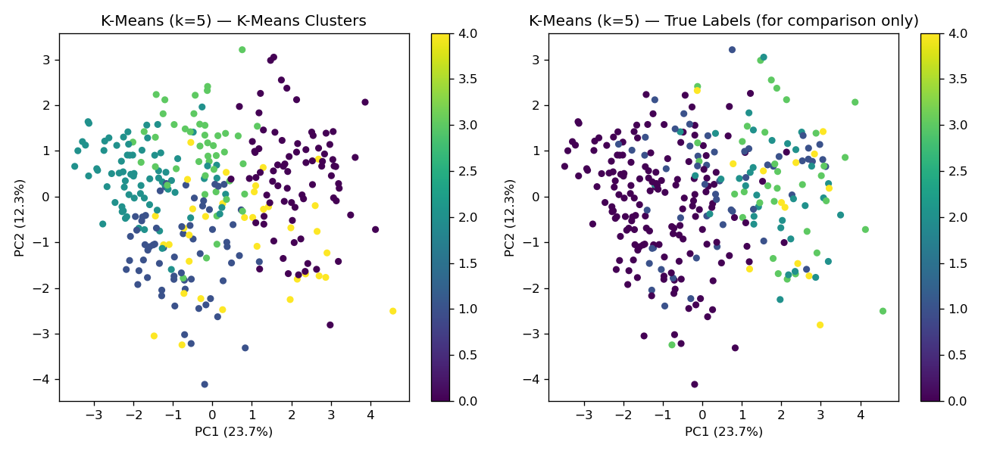

## Unsupervised / Clustering 

[ReadMe](README.md)        [Preprocessing](DataPreprocessing.md)

Unsupervised learning is tried out using K-Means, first with K value of 2 — Ok, and Disease — to do a comparison study with labelled data, and then K value of 5.  The target 'num' column is dropped deliberately, and it is used in evaluation.

Similarly as in predictive analysis, binarised outcome is closer to the actual.

| K = 2 | K = 5 |
| --- | --- | 
| |  |