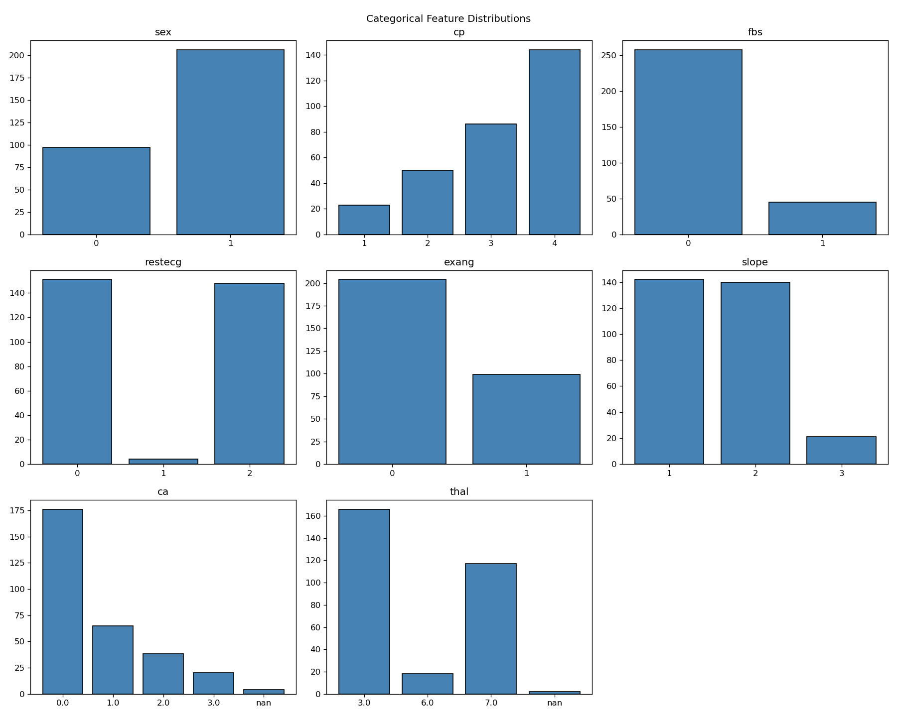
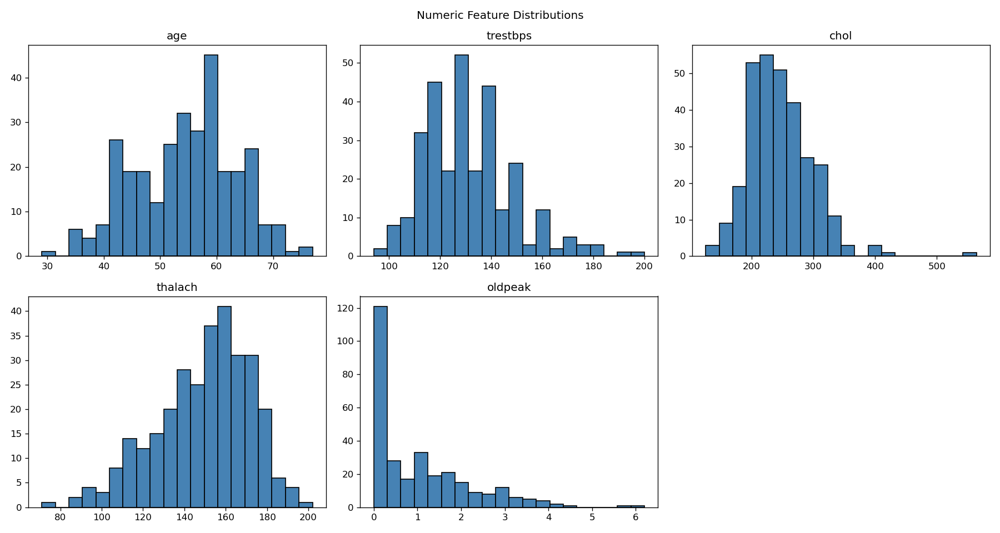
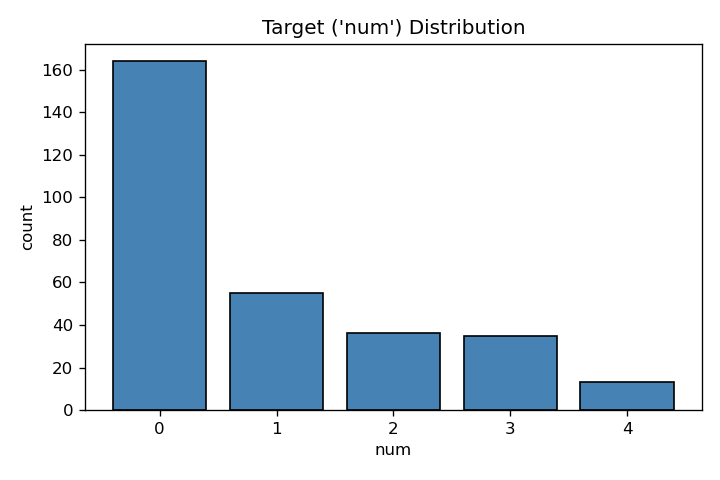

## Descriptive Analysis

[ReadMe](README.md) [Exploratory](Exploratory.md)

The descriptive analysis shows the distribution of categorical features, numeric features and target. The bars shows how many patients have that feature.

### Categorical distribution

### Numeric distribution

### Target distribution
