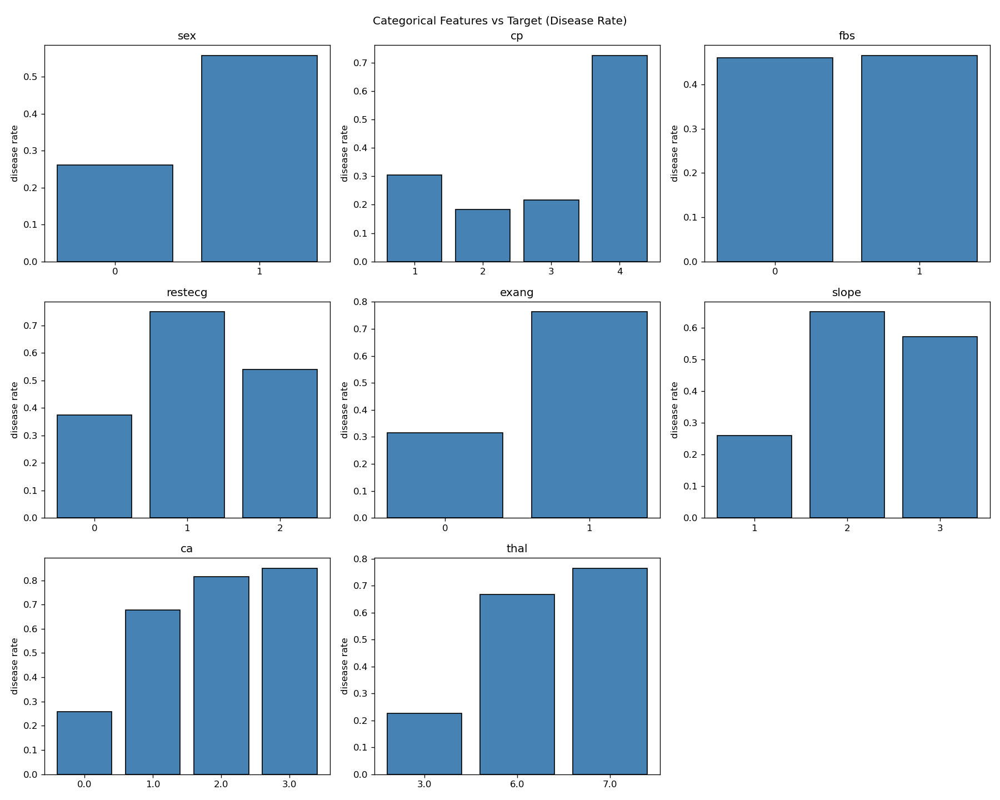
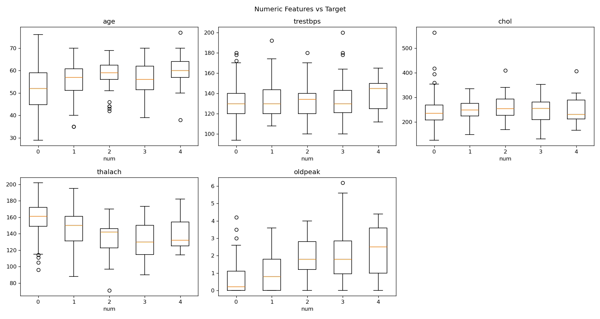
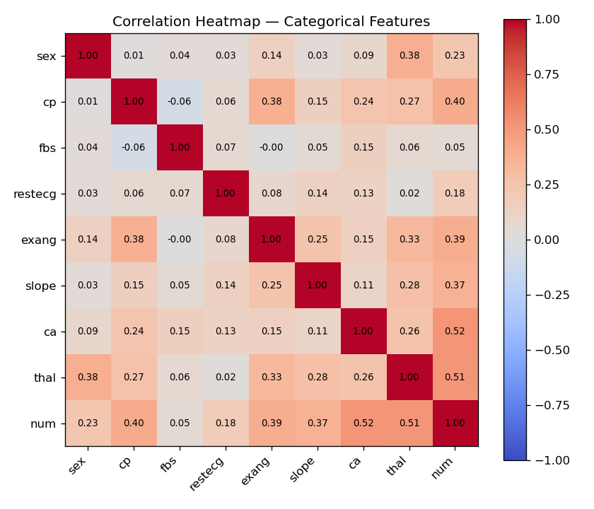
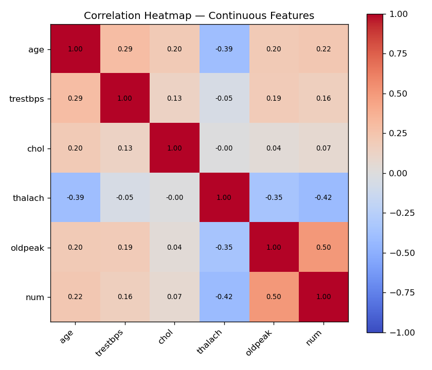

## Exploratory Analysis

[ReadMe](README.md)        [Predictive](Predictive.md)

Exploratory analysis gives the information about the relation between the categorical features and the target — binarised as disease or no-disease. In the following diagram, for example, the __cp__ chart shows that about 70% of the patients who felt 'cp' (chest pain) level 4 have the disease.

Another exploratory analysis gives the information about the relation between the continuous features and the target — from 0 to 4. In the following diagram, for example, the __age__ boxplot shows that the patients of the disease at level 4 are about 60 years old in average.

Two heatmaps are drawn separately — one for categorical features and one for continuous features.

Heatmap for categorical features:    

Heatmap for numeric features:     
