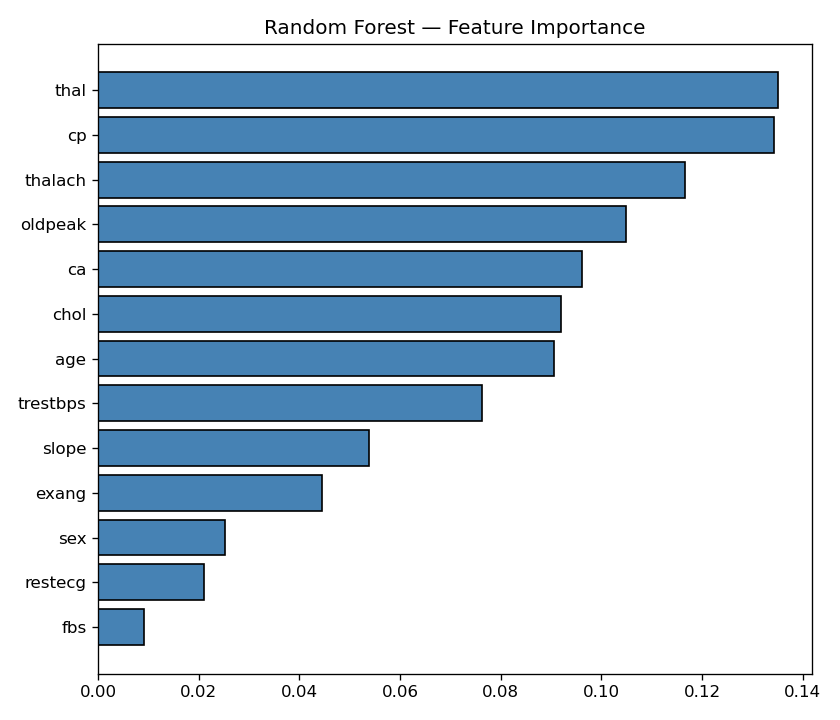
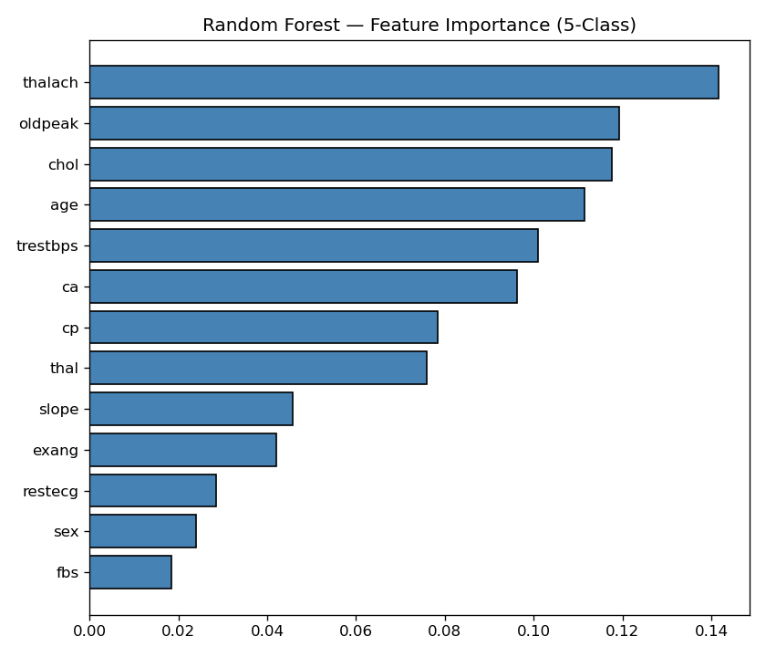
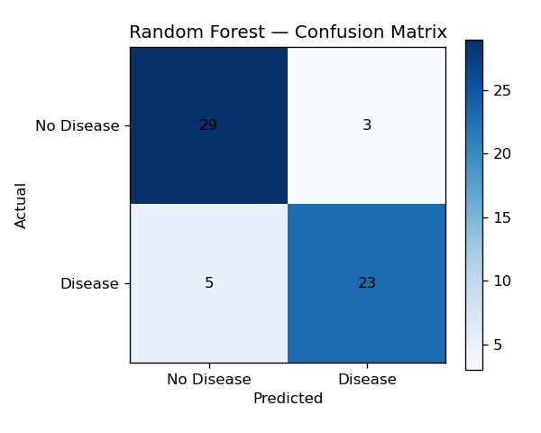
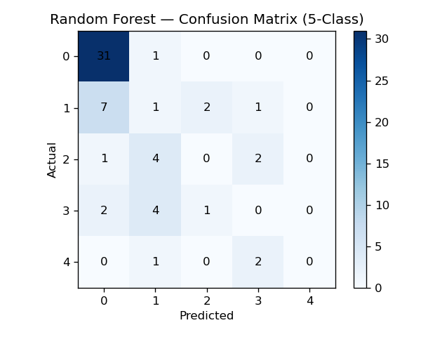
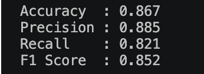
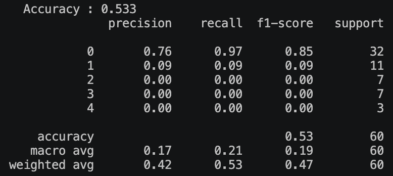

## Predictive Analysis

[ReadMe](README.md)        [Preprocessing](DataPreprocessing.md)

The predictive analysis gives the feature importance — how much that feature is related to the target —  the range of 0 to 4 or there is disease or not. 
| Feature Importance (Disease or Not) | Feature Importace (0 - 4) |
| --- | --- |
| | |

However, the data is too skewed to use 5 classes for prediction. The following table shows the evaluation comparison between 5-classes prediction results and binarised results.

| Information | Binarised | 0 - 4 |
| --- | --- | --- |
| Random Forest Confusion Matrix| |  |
| Accuracy Metrics | |  |