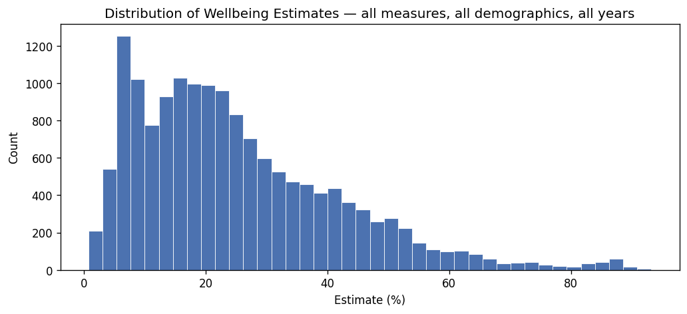
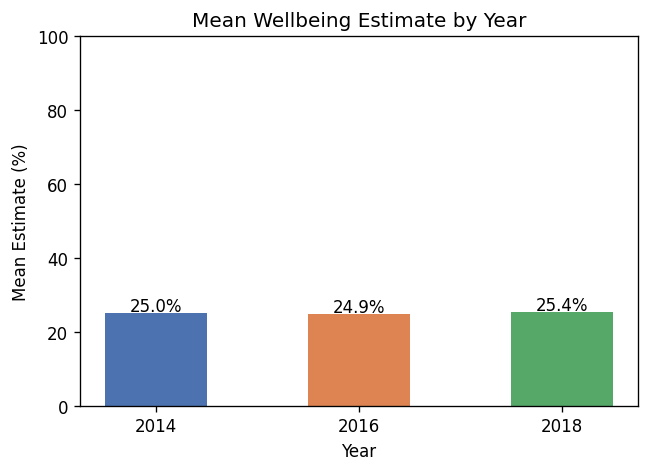
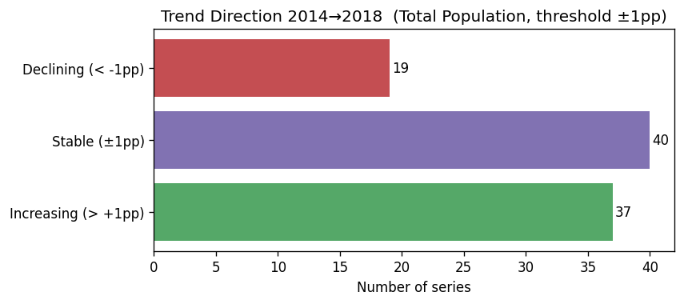
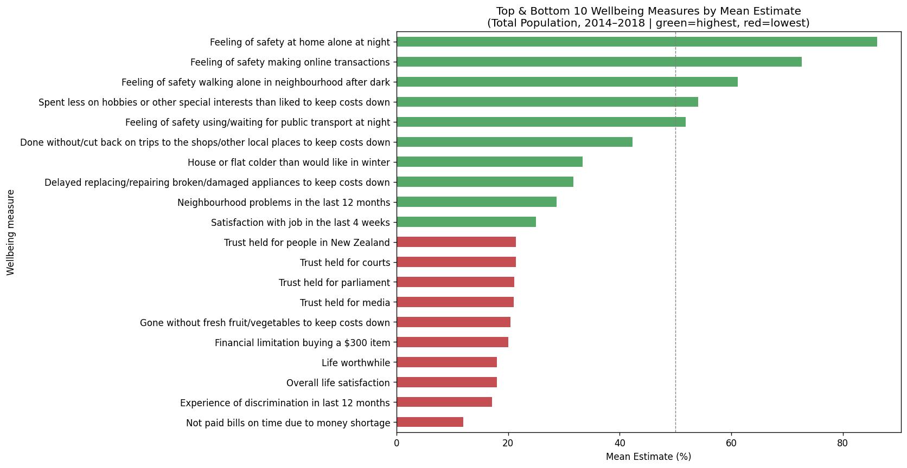
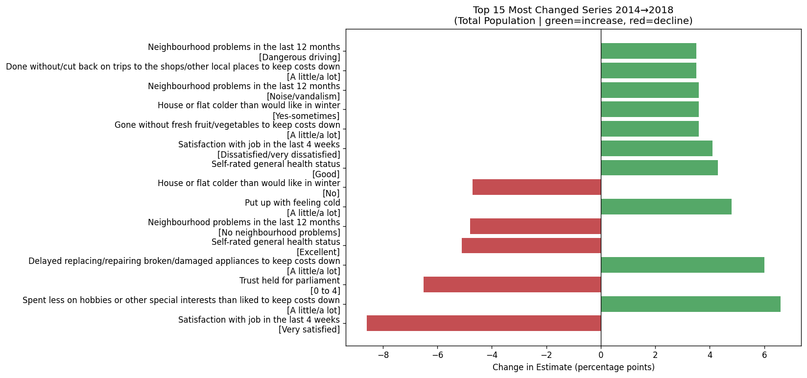
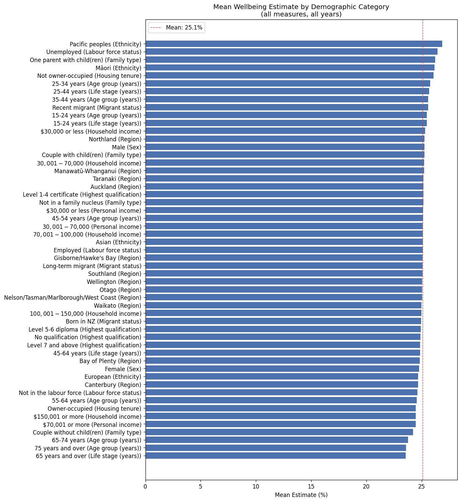
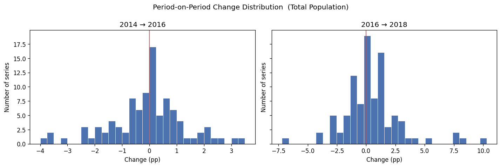

# Exploratory Data Analysis

## Dataset Overview

| Metric | Value |
| --- | --- |
| Records after cleaning | 15509 |
| Unique wellbeing measures | 30 |
| Unique demographics | 13 |
| Unique demographic categories | 51 |
| Years | 2014, 2016, 2018 |
| Total Population series | 96 |

---

## Trend Analysis — Total Population (2014→2018, threshold ±1pp)

| Direction | Series | % |
| --- | --- | --- |
| Increasing (> +1pp) | 37 | 38.5% |
| Stable (±1pp) | 40 | 41.7% |
| Declining (< -1pp) | 19 | 19.8% |

---

## Charts

